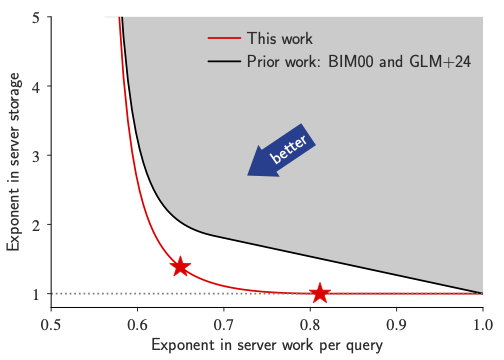
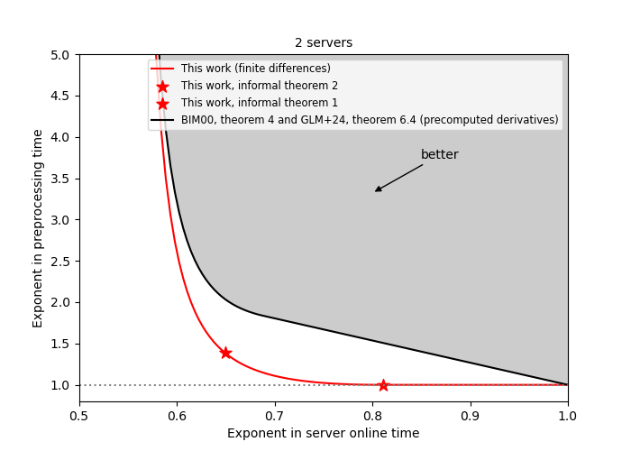
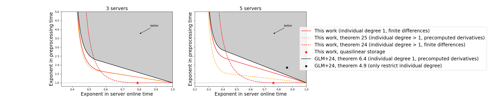

# Two-Server Private Information Retrieval in Sublinear Time and Quasilinear Space

This repository contains the code accompanying the paper ["Two-Server Private Information Retrieval in Sublinear Time and Quasilinear Space"](https://eprint.iacr.org/2025/2008.pdf) 
by Alexandra Henzinger and Seyoon Ragavan (EUROCRYPT 2026).

**Warning**: This code is a research prototype.

> Paper abstract:
> 
> We build two-server private information retrieval (PIR) that achieves information-theoretic security
and strong double-efficiency guarantees. On a database of n > 10^6 bits, the servers store a preprocessed
data structure of size 1.5 sqrt(log n) * n bits and then answer each PIR query by probing 12 n^0.82 bits in this
data structure. To our knowledge, this is the first information-theoretic PIR with any constant number
of servers that has quasilinear server storage n^(1+o(1)) and polynomially sublinear server time n^(1−Ω(1)).
>
> Our work builds on the PIR-with-preprocessing protocol of Beimel, Ishai, and Malkin (CRYPTO 2000).
The insight driving our improvement is a compact data structure for evaluating a multivariate polynomial
and its derivatives. Our data structure and PIR protocol leverage the fact that Hasse derivatives can
be efficiently computed on-the-fly by taking finite differences between the polynomial’s evaluations.
We further extend our techniques to improve the state-of-the-art in PIR with three or more servers,
building on recent work by Ghoshal, Li, Ma, Dai, and Shi (TCC 2025).
>
> On an 11 GB database with 1-byte records, our two-server PIR encodes the database into a 1 TB data
structure—which is 4,500,000× smaller than that of prior two-server PIR-with-preprocessing schemes,
while maintaining the same communication and time per query. To answer a PIR query, the servers
fetch and send back 4.4 MB from this data structure, requiring 2,560× fewer memory accesses than
linear-time PIR. The main limitation of our protocol is its large communication complexity, which we
show how to shrink to n^0.31 * poly(lambda) using compact linearly homomorphic encryption.

Asymptotic costs of our new two-server PIR with preprocessing, compared to prior work:
> 

## Overview

This codebase consists of the following directories:

- `pir`: An implementation of our two-server, information-theoretic protocol in Go and C.
  - `pir.go`: implements the PIR scheme's operations (Query, Answer, Recover).
  - `database.go`, `encoded_database.go`: stores and preprocesses the database into the lookup-table data structure required for PIR.
  - `polynomial.go`: picks parameters for the polynomial encoding of the database, and implements the encoding function (which maps each database index to an input point).
  - `lookup_batch.c`: C code for the database lookups perfomed in the online phase of the PIR scheme.
  - `pir_test.go`: correctness tests and latency and throughput benchmarks.
  - `csv.go`: performance logging code.
- `cost_calculations`: Code for calculating costs, both asymptotic and concrete, of our various protocols. Includes scripts for reproducing Table 1 and the asymptotic cost plots in our paper.

## Setup

To run the PIR protocol, install [Go](https://go.dev/) (tested with version 1.22.2) and a C compiler (tested with GCC 13.3.0). To obtain our performance numbers, we run our benchmarks on an AWS EC2 `r7a.metal-48xl` instance running Ubuntu 24.04. 

To produce the plots, additionally install [Python 3](https://www.python.org/downloads/), [NumPy](https://numpy.org/) and [Matplotlib](https://matplotlib.org/).

To run on machines that do not support the `-march=native` C compiler flag, it is possible to remove this flag from `pir.go` at some performance degradation.

## Usage: Running the PIR scheme

### Correctness tests

For all PIR correctness tests, run:
```
cd pir/
go test
cd ..
``` 
This suite runs the following tests: `TestEncoding*` verifies that the preprocessing step produces a correct database encoding; `TestPIR*` verifies that executing the PIR protocol correctly returns the database bit being read; `TestFakePIR*` returns the PIR costs for executing PIR on a database of a given size (but, rather than performing the slow preprocessing step, it makes queries to a randomly generated lookup table). Running the full test harness takes 2-3 minutes. (To speed up the test harness, or to avoid running out of memory on small machines, comment out the biggest test cases in `pir_test.go`).

The test suite prints logging output that indicates whether all tests have passed. On success, it should roughly look as follows:
```
Alloc = 15 GiB   TotalAlloc = 108 GiB   Sys = 91 GiB   NumGC = 306
PASS
ok      github.com/ahenzinger/finite-diffs-pir/pir      133.823s
```

### Performance benchmarks

To benchmark our PIR scheme's latency, throughput (without networking), storage, or communication with given database parameters (i.e., a given choice of the number of variables `m` and the total degree `D` and a given record length in bytes), update the corresponding values of `m`, `D`, and `Record_len` in the functions `BenchmarkLatencyPIR` and `BenchmarkTputPIR` in  `pir_test.go`. Then, run:
```
cd pir/
go test --bench PIR --run Benchmark
cd ..
``` 
This command has been tested with all parameter choices in [Table 2](https://eprint.iacr.org/2025/2008.pdf) in the full version of the paper (which each run an instance of PIR with a 1 TB preprocessed data structure), and can be used to reproduce this table. The latency measurement runs with a single thread. The throughput measurement runs with many threads to saturate the machine. (The number of threads can be set in the `BenchFakeTput` routine in `pir.go`.)

The benchmarking command prints out logging information, which includes the communication, the storage (including how much storage was saved relative to BIM04), and the server work. For example, running with `m=35`, `D=9`, and `Record_len=1` produces (on a `r7a-4xlarge` machine with `128 GB` of RAM and 16 vCPUs):
```
Benchmark DEPIR, latency
Executing ~fake~ DEPIR over database of 70607460 1-byte-length records: 0.065758 GB
       parameters: m = 35, D = 9 --> could handle up to 70607460 records
    Setup (~fake~)...
        original db size: 0.065758 GB --> encoded to 32.000000 GB
    Building 2 queries...
        took 4.19µs
        query size: 64 bits
    Answering 2 queries...
[0.000917884]
        answer size: 58.140625 KB = 0.056778 MB
        average answer time per query: 0.000918 s
        std dev of answer time per query: 0.000000 s
        BIM storage would be: 1860.500000 TB --> worse by 59536.000000 x
Alloc = 32 GiB   TotalAlloc = 32 GiB   Sys = 32 GiB   NumGC = 5
goos: linux
goarch: amd64
pkg: github.com/ahenzinger/finite-diffs-pir/pir
cpu: AMD EPYC 9R14
BenchmarkLatencyPIR-16                 1        3356116042 ns/op
Benchmark DEPIR, tput
Tput for ~fake~ DEPIR over database of 70607460 1-byte-length records: 0.065758 GB
Alloc = 32 GiB   TotalAlloc = 64 GiB   Sys = 32 GiB   NumGC = 7
    Tput experiment
    Queries answered in 10.698315807s: 146715 -- Tput: 13713.840818 queries/s
    Queries answered in 20.698889088s: 284190 -- Tput: 13729.722344 queries/s
    Queries answered in 30.699927681s: 421567 -- Tput: 13731.856452 queries/s
    Queries answered in 40.81588345s: 560137 -- Tput: 13723.505475 queries/s
    Queries answered in 50.81693609s: 698168 -- Tput: 13738.884193 queries/s
    Queries answered in 1m0.940631425s: 837361 -- Tput: 13740.602623 queries/s
    Queries answered in 1m11.06841603s: 975958 -- Tput: 13732.654455 queries/s
    Queries answered in 1m21.198977804s: 1114365 -- Tput: 13723.879661 queries/s
    Queries answered in 1m31.19911376s: 1251759 -- Tput: 13725.561010 queries/s
    Queries answered in 1m41.199202848s: 1388708 -- Tput: 13722.519159 queries/s
    Queries answered in 1m51.199986283s: 1525703 -- Tput: 13720.352412 queries/s
    Queries answered in 2m1.200943762s: 1660719 -- Tput: 13702.195284 queries/s
    Queries answered in 2m11.202931599s: 1797213 -- Tput: 13697.963743 queries/s
    Queries answered in 2m21.203926376s: 1933217 -- Tput: 13690.957820 queries/s
    Queries answered in 2m31.205006143s: 2069792 -- Tput: 13688.647306 queries/s
    Queries answered in 2m41.205532994s: 2206977 -- Tput: 13690.454409 queries/s
    Queries answered in 2m51.205658088s: 2343600 -- Tput: 13688.799927 queries/s
    Queries answered in 3m1.317919779s: 2481772 -- Tput: 13687.406093 queries/s
    Queries answered in 3m11.318996224s: 2617776 -- Tput: 13682.781384 queries/s
    Queries answered in 3m21.319808778s: 2754717 -- Tput: 13683.288379 queries/s
BenchmarkTputPIR-16                    1        215063206367 ns/op
PASS
ok      github.com/ahenzinger/finite-diffs-pir/pir      220.400s
```
On the `r7a-4xlarge` machine, the command runs in under 4 minutes.

## Reproducing results from the paper

### Asymptotic plots (Figures 1, 4)

To generate the asymptotic plots of our PIR scheme's performance, run:
```
cd cost_calculations/
python3 generate_plots.py --two-server-path 2serverfig.png --multi-server-path multiserverfig.png
cd ..
```

This command generates two files: `cost_calculations/2serverfig.png` and `cost_calculations/multiserverfig.png`. These files should look as follows, and reproduce the asymptotic plots given in Figure 1 and Figure 4 of the paper's conference version: 





### Analytical costs (Table 1)

To analytically generate the concrete costs of our PIR scheme with a particular choice of parameters, and in particular compare its storage overheads to those of prior work (BIM04), see the notebook in `cost_calculations/table_1.ipynb`. This notebook reproduces the contents of [Table 1](https://eprint.iacr.org/2025/2008.pdf) in the full version of the paper.

### Performance measurements

Reproducing the measurements from section 6 requires a machine with 1 TB of memory. To reproduce the numbers, run the performance benchmarks as described above (run with `go test --bench PIR --run Benchmark`), using the following parameters:

- 11 GB database with 1-byte records: `m = 40`, `D = 13`, `Record_len = 1`

- 2 GB database with 1-byte records: `m = 40`, `D = 11`, `Record_len = 1`

The storage, communication, and number of memory accesses can be reproduced on any machine. (The number of memory accesses performed in our scheme is equal to the reported PIR download.) Reproducing the throughput numbers requires running on a setup with a comparable number of cores (192 in our case).

## Citation

```
@inproceedings{HR26,
      author = {Alexandra Henzinger and Seyoon Ragavan},
      title = {Two-Server Private Information Retrieval in Sublinear Time and Quasilinear Space},
      booktitle = {EUROCRYPT},
      year = {2026}
}
```
